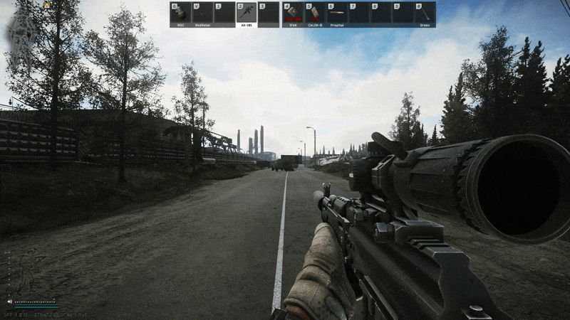

# Mag Retention Reload

> A similar mag retention feature is already part of **UI Fixes** by **Tyfon**.  
> I originally started working on this mod without knowing that it existed there and by the time I found out, my version was already mostly finished.
>
> This mod keeps the behavior simple and does not add any reload time penalties which may be preferable depending on your setup.

## 📜 Description

**Mag Retention Reload** is a mod for *Single Player Tarkov* that adds proper magazine retention to weapon reloads by automatically stowing the old magazine back into the rig if possible instead of dropping it.

## ✨ Features

* Swaps the old magazine into the slot the new magazine was taken from
* Prevents unnecessary magazine drops during normal reloads if the magazine fits in the rig
* Works with both the reload hotkey and the inventory context menu

## 📁 Installation

* Download the latest release
* Copy the `BepInEx` folder into your SPT folder
* Start the game

## 📷 Preview

## ⚠️ Known Issues

* When playing with **Fika**, players who don’t have this mod installed won’t see the reload animation for players who do

## 🙏 Acknowledgements

Thanks to [**Lacyway**](https://github.com/Lacyway) for putting up with all my questions

## 📄 License

Distributed under the MIT License. See `LICENSE` for more information.
